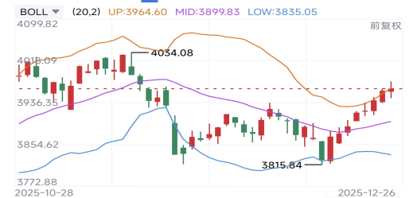
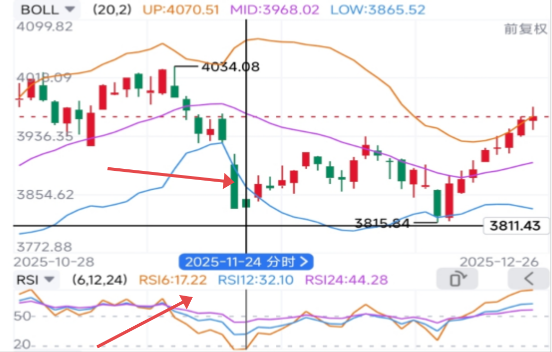
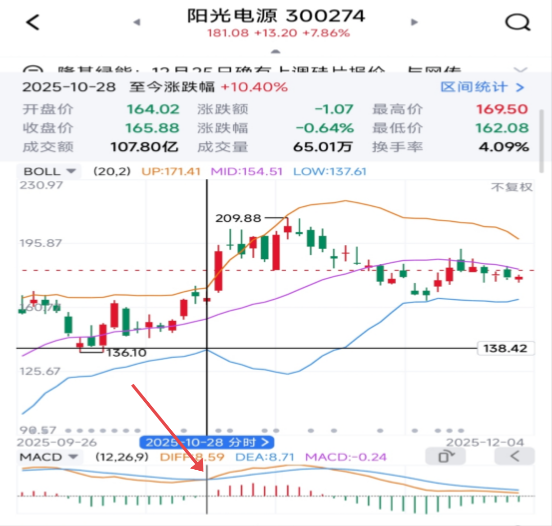
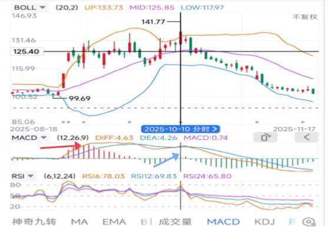
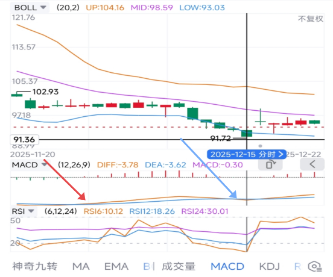
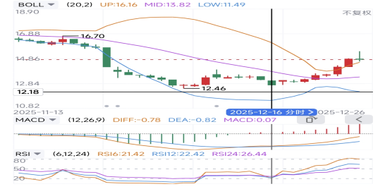
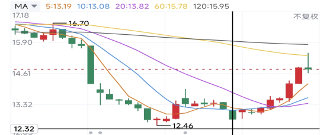
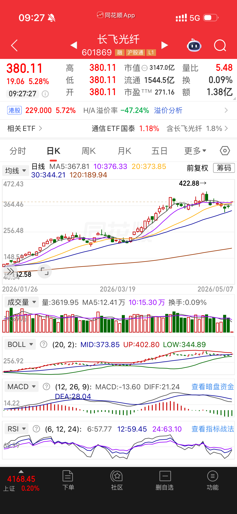

[//]: # "下一行开始到<!--more-->为引文部分，引文会显示在预览中"

<!--more-->

[//]: # "下一行开始为正文"
知乎「奥特之父」的收费文章，看了以后觉得很有收获，在此复习，并供日后复盘交叉验证。

# 原文

## BOLL布林线

BOLL，主要用于研判股价波动范围及趋势。其核心由20日移动平均线（中轨）加减2倍标准差形成的上轨线和下轨线构成，其中上轨与中轨发挥压力作用，下轨与中轨发挥支撑作用。

上图就是一个典型的布林线的样子，现在的软件会给你做好UP/MID/LOW三条轨道。我们会发现，因为数据的滞后作用，布林线在下穿下轨后总是很容易重新向上，碰到上轨则大概率会回落。

那么这三条线平时怎么用呢？尤其在个股上面，有些个股并不会遵循这个规则，可能一路向上或者向下。那么记得，如果布林线连续突破上轨（比如三连突破，看图的右边），且两条线呈现敞口，则后市比较乐观。连续向下突破，也一样。

对于大盘来说，就好办多了。比如大盘到了boll下轨，如果你是一个红利股或者白马股的投资者，就可以安排买入的操作。反之，可以在上轨时适当减仓。一些长期主义的投资者，如果看好公司的，也可以用这个方法达到定投的利益最大化。有时候在中轨上，执行买入或卖出操作时就可以等等。

打个比方，我计划每个月投资2000块“定投”到可口可乐公司，结果1月没到下轨，2月到了，这时候就可以投入4000块；如果到了3月，boll到了上轨，减仓2000且不投资，到了4月，重新到了下轨，这时候把之前减仓的2000连同3/4月的资金一起重新打入。长久下来，我们可以获得比股息更高的利益。当定投的金额积少成多了以后，每次boll上轨减仓的金额可以略微放大。

对于我个人来说，BOLL更多是一个结合多种指标的辅助功能，除了大盘的研判我很喜欢使用BOLL线（比如连续下穿下轨两天，回升的概率在75%）以外，我会十分依赖另两个指标：RSI和MACD

## RSI相对强弱指标

RSI是根据一定时期内股价上涨和下跌幅度之和的比率制作出的一种技术曲线，能够反映出市场在一定时期内的景气程度。**一般我们默认用6.12.24这三个周期的RSI来判断是否超买或者超卖**。

**比如RSI6低于20，则处于超卖状态；RSI6低于10，则判定为严重超卖。反之，超过80，处于超买状态，超过90，则严重超买。**对于我个人而言，RSI、MACD结合BOLL，比KDJ单一指标要准确很多。

我以11月24日大盘的BOLL线为例，还记得那一天大家有多悲观么？上证七天时间从4034直插3816，而我坚定看多，为何？就因为这一天的RSI6低于20，且显著低于RSI12、24。超卖我们可以理解成什么呢，就是一些非理性的卖盘，这些非理性的卖盘同时也会变成非理性的买盘，有点像追涨杀跌的韭菜们。而前两天，其中11月20日的RSI超过30，11月21日RSI是16.28。也就是说，11月21日，那天应该是周五，就应该坚定看多。有心人可以翻翻我那一天的股评哈。（另外，还有一招，就是很多人在**不触及boll上下轨时看到一个心仪的标的，很想买，这时候可以等大盘或者个股的RSI6上穿RSI24时买入**。个人经验来说，A股胜率六成，美股胜率比较高）

那反过来，如果RSI大于70，同时又触及了BOLL的上轨，是否要减仓呢？或者我个股有没有可能一路长虹呢？这个答案也很简单。

两种，一种是高频，大开大合的，要减全清，要加全增。像我这种稳健派，则是降低一些仓位或者增加一些仓位。最重要的，则是还有一个指标必须要观察：

MACD！

## 最强辅助，MACD

**MACD**称为异同移动平均线，是从双指数移动平均线发展而来的。方便点，不需要知道原理，我们只需要知道DIFF和DEA线怎么用即可。

MACD里面有四个远比MA准确的信号，金叉、[死叉](https://zhida.zhihu.com/search?content_id=268236689&content_type=Article&match_order=1&q=死叉&zhida_source=entity)、顶背离（缠论的顶背驰抄它的）、底背离。更幸运的是，同花顺似乎里面能直接套用部分基于这个的免费策略。当然，还是给大家讲清楚怎么用。

### 金叉

金叉的意思，**是DIFF/DEA都在中线上方，DIFF向上突破DEA（绿柱转红柱）**时。这个算是比较积极的买入信号，适合趋势交易爱好者。

箭头处为金叉

我们拿阳光电源举例，在10月28日这天，股价触及BOLL上轨，且和9月26日的头部隐隐然形成一个M头的位置。然而第一，RSI没有超买，第二，MACD此时形成一个金叉（黄线DIFF突破蓝线DEA），那么两票对一票，此时即使卖出，也只能卖一点才对！最好就是持股待涨。

### 死叉

死叉什么意思呢，就是反过来，DIFF、DEA都在中线下方时，DIFF向下下穿DEA时形成死叉。**这个指标相当不准**……为何，比方我们买的是白马股，往往磨底时容易出现死叉，但长线看此时买入只要拿住，胜率都不错。以超级大烂股隆基绿能为例，上一次出现MACD死叉是2025.5.27，股价14.44元，够丧吧，等下一次金叉股价已经回到17.5元了。所以说，这个指标，大家记住，可以辨别伪股神！就是说，如果一个人跟你说什么MACD死叉卖出的，取关即可。**MACD死叉的权重是远弱于BOLL和RSI的**！

### 顶背离（卖出信号）

我们拿今年至今我因为失误亏损的（本来不至于的），长春高新为例。**这个顶背离啥意思呢，就是股价连创新高到BOLL的上轨附近，但是DIFF、DEA并没有一起创新高反而比上一次高点要低，这时候，就要跑了**！

红色箭头为前高，比股价实际新高的蓝色箭头更高，为顶背离

来，看看2025-10-10日，长春高新创下新高141.77（蓝色箭头位置），当时我志得意满，注意力也都在一路高歌猛进的机器人上面，没去看MACD此时竟然出现了背离（甚至没有9月上旬高），同时，RSI轻微超卖，股价到达BOLL上轨！

全票卖出！！！！！但是我没看！！！！！另外大家看一下股价在99.69时的下一天，BOLL下轨，是不是出现了金叉？这个时候买入，40cm大肉，一个月的时间啊！！！！

### 底背离（买入信号）

**当你的股价在下跌出新低时，DIFF、DEA并未一起出现新低，这个时候就是底背离信号了**，对于喜欢做左侧的我来说，这个信号过于甜蜜。在牛皮市或者熊市时，或者网格化交易时，我也经常使用这个指标来执行买入操作。

还以长春高新为例：

蓝色箭头处为底背离

股价来到95下方后触及BOLL下轨，RSI低于20，MACD出现底背离（你们看左侧股价100时明显比股价93时还要低很多），此时不补更待何时？上一次40cm忘记吃了，这一次别错过。

## MA均线

MA，均线，主要用来衡量两个东西，一个是大家的平均持仓成本，一个是阶梯建仓（网格交易法）时筹码的大小。

平均持仓成本咋看呢，很简单，你看换手率。比如这几天都不到1%换手率的，你就看ma120（一般意义上的半年线），如果换手率3%左右的，就看ma30。如果公司不是一个成长性很强的，打个比方业务稳定的制造业，又或者某项领域的垄断国企，就很适合在$MA_n$（看换手率，懒得算的用ma120）下方，同时满足大部分上述指标（rsi、macd、boll）买入需求时入手。反之，超得多了，也就到了离场的时节，或者说至少没必要加仓了。

MA均线另一个比较有用的方式则是大趋势判断，比如均线多头排列，那么此时卖出信号通常可以“等一等”，反之，买入也可以“等一等”。对于弱势股，如果短期从买入信号出现时达到了合适的均线位置，可以考虑撤出一部分。

我们拿前段时间星球里大家争论激烈（当然最后我胜出）的京基智农为例：

京基智农其实在12月头就已经出现了买入信号，比如股价大幅低于ma120，下穿布林线下轨，RSI低于10。唯一不确定的就是MACD没有背离，而12月16日时，MACD背离，同时符合ma120下方12厘米以上的特征，RSI虽然超过20但也差不多。所以这时候也是可以买入的。果然，之后连续上攻，来到了这个位置：（大家看最右的绿色十字星是不是上穿了ma60？）那么作为一支比较弱势的高分红股票，如果你不太信任这个公司，来到了平均持仓成本这个地方，就可以落袋为安了，保守也有10个点的收益。相对于一个月不到的时间成本，其实也是相当优秀的收益了。

# 实例

## 2026-05-07长飞光纤

### BOLL

布林线缩口接近重合，价格在中轨上下小幅震荡，指标信号不明显。

### MACD

DIFF、DEA在中线上方，未出现明显金叉或背离信号。

### RSI

6、12、24线均在60左右，交易当日6日线上穿12日线，逼近24日线，弱买入信号。

### MA

持仓成本，近10个交易日换手率在4%左右，参考 MA20、MA30均线，购入成本价377.100，高于MA20均线，略高于期望成本，可接受。

### 行业概念

光纤是热门行业概念，判断短期内还有上攻趋势。

### 操作记录

2026-05-07买入价377.100\*100，2026-05-08卖出价388.500\*100，实现盈利1134.62，盈利幅度3.01%，上涨趋势强度与弱买入信号相符，但卖出后盘中涨速扩大，高至405.00，收397.23，基本符合预期。

## 

