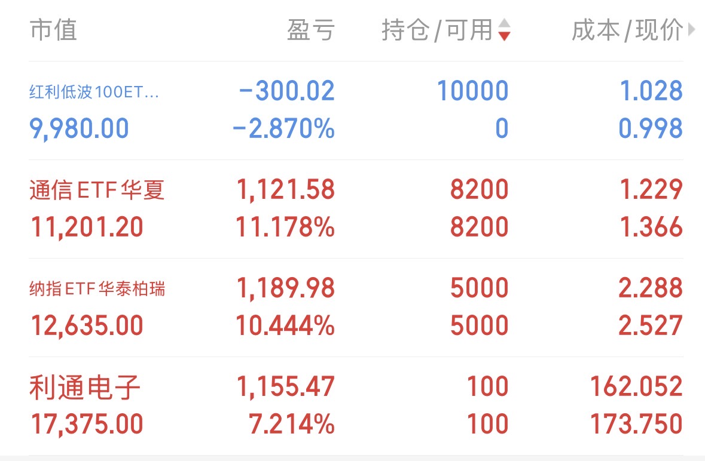

[//]: # "下一行开始到<!--more-->为引文部分，引文会显示在预览中"

<!--more-->

[//]: # "下一行开始为正文"
### 投资逻辑反思

最近配置一万块红利低波，两天跌了3个百分点300块离场，离场后跌幅扩大至3.6百分点，变成了妥妥的高波，反思了一下自己的购买逻辑。

动机层面是闲的，单纯不想大资金空仓。当前纳指和A股的几个诸如光通信、CPO等等重点板块都在高位，除此之外都在跌，前期建仓的优质标的继续持有，但是价格不适合买入，除此之外的标的又都在跌，短期没啥好买的，恰好看到红利低波在相对低位，觉得可以入手。

基本面判断层面，进红利低波之前没有关注CPI、社零等等数据，5月社零在疫情后首次单月同比为负，通缩背景下消费股显出颓势是大概率事件；同时当前红利股的股息率普遍未达5%，分红收益不足以覆盖下跌风险。综合来看不是合适的买点。

当然我反思的重点不是这个，而是更加形而上层面的东西。

我问自己一个问题，我投资的目的是什么？

废话，投资的目的当然是为了赚钱。那，抛开赚钱之外呢？

那一刻，我悟了，我在股市里领悟焚诀往往都是在亏完钱抓耳挠腮找原因的时候，虽然亏300约等于没亏，但也是亏，总之我悟了——我投资的终极目的，是为了自己心目中更好的世界投\~票\~ ！

### 何为更好的世界

举个例子，假如苹果的产品，手机、手表、Mac，等等，我觉得好用，我相信会有很多其他人跟我一样也喜欢购买这些产品，我也希望其他人也能体验到使用这些产品带来的幸福感——便捷、高效、流畅的使用体验。同时，我持有了苹果的股份，成为了苹果的股东。这就构成了一个正向循环：

+ 其他人买越多苹果的产品，我就能享受到越多的分红；
+ 我在二级市场购买苹果的股票，提升了其资本表现，不论是提升其企业知名度、股权激励的强度还是减持带来的直接收益，都有（哪怕微乎其微的）正面作用。**这就叫做更好的世界**。

反过来呢？贵州茅台是红利低波的成分股，我拆解一下投资茅台的逻辑。

+ 第一，市场角度看，2016~2025年白酒销量持续走低，根据统计局口径，2025年白酒销量354.9万千升，较 2016 年的历史峰值 1358.4 万千升相比，已缩减超过七成，且行业整体面临严重库存压力，茅台作为头部酒厂集中了行业绝大多数利润，暂时利润承压相对不那么明显，但整体颓势难掩，市场基本面不支持投资；
+ 第二，个人消费接纳程度上，我除工作应酬外不喝酒，也不希望周围人喝酒，就算喝酒也不会花我自己的钱买白酒，站在个人的角度我不会为包括茅台在内的白酒厂花一分钱消费；
+ 第三，在第二点的基础上，我投资白酒的每一分钱，都会助力于白酒的扩产和营销，最终变成射向我自己和身边人的子弹。对于这种企业，我巴不得它早点亏损倒闭，**世界上少了茅台，对我来说那当然是变得更好了一点**。

以上三条理由，足以说服我坚决不持有白酒相关的标的，我姑且把它当做是我的投资品味。马前卒讲「保卫我们的现代生活」，我认同「现代生活」确实是需要付出一些代价去保卫的。我中意路边便利店3块就能随手买到给人带来廉价满足感的冰可乐，我享受爬出游泳池骑车到路口麦当劳来一根麦当劳甜筒。可口可乐，麦当劳这些标的，哪怕赚的钱没有SPY7的科技巨头多，我也不会吝啬自己的一部分仓位持有它们。真金白银的支持，就是在构建和保卫属于我自己的现代生活，就是在投资一个更美好的未来。

### 补充

6月20号的截图，博时调仓已经把贵州茅台剔除了，估计是股息率过低的缘故。究竟是正常的行业周期波动，还是「这次不一样」式的走下神坛，且拭目以待。

